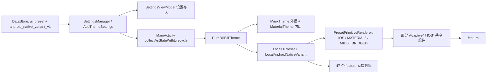
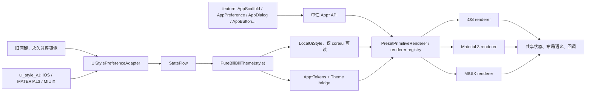

# BiliPai 三风格 UI 设计系统审查与迁移路线

审查日期：2026-07-27。范围：`app/src/main/java` 的生产 Kotlin，重点覆盖首页、设置、普通 feature、播放器与插件 UI。初版只审查和规划；自 2026-07-28 起按本文阶段持续记录实施状态。未读取、请求或分析截图。

## 实施进度

更新日期：2026-07-28。按“审查 + 阶段 0～5”等权计算：

`[█████████████░░░░░░░] 64%`

| 工作项 | 状态 | 已落地内容 |
|---|---:|---|
| 审查与路线 | 100% | 架构、清单、阶段、风险与复跑命令已记录 |
| 阶段 0：契约与兼容层 | 100% | `UiStyle`、`ui_style_v1`、新旧三键双写、导入导出兼容、Theme bridge、冲突诊断与矩阵测试 |
| 阶段 1：设置列表试点 | 100% | 中性 `App*` preference/dialog/segmented 入口；设置试点迁移；旧 Local 与 IOS* 调用棘轮达标 |
| 阶段 2：Chrome 与导航 | 100% | 中性 `AppScaffold/AppTopBar/AppNavigation` 入口；30 个旧调用文件迁移；home/navigation policy 改读 `UiStyle`；棘轮达标 |
| 阶段 3：普通 feature | 50% | 卡片与输入首批已完成；普通 feature 的 Dialog/Sheet 已全部收口到中性门面，共迁移 24 个调用点 |
| 阶段 4～5 | 0% | 等待后续按播放器/插件、清理边界顺序推进 |

阶段 0 保持渲染行为不变：`LocalUiStyle` 与旧两个 Local 同时提供，旧设置入口继续可用；合法新键优先，缺失或非法新键回退旧两键。iOS 写入保留隐藏的 Android native variant，设置分享同时携带新键和旧两键。兼容层新增 2 个引用旧类型的 core 文件，因此全生产计数为 103；受阶段棘轮约束的 feature/直接 Local/IOS* caller 仍为 **69/47/42**，符合阶段 0“不新增、暂不要求下降”的边界。

阶段 1 不重写 renderer：`AppPreference`、`AppSwitchPreference`、`AppSliderPreference`、`AppSegmentedControl` 及配套 group/divider/text-field/dialog 入口继续委托已验证的自适应实现。`SettingsSections`、Appearance、Playback、Plugins 等 14 个设置文件已迁到中性入口；8 个设置实现改读单一 `LocalUiStyle`，旧 renderer 参数通过 core 兼容桥集中映射。阶段棘轮由 **69/47/42** 降至 **61/39/28**，分别达到 `<=61`、`<=39`、`<=28`；新增 API 委托契约测试与三风格 renderer bridge 矩阵，Kotlin 编译及相关设置窄测通过。

阶段 2 保留既有 adaptive renderer，只增加并迁移到中性 `AppScaffold`、`AppTopBar`、`AppNavigation`、`AppSideNavigationRail`、`AppSplitLayout` 门面；feature 与 navigation 中旧 Chrome 调用已由 **30 个文件降至 0**，对应调用点全部切到中性入口。首页刷新、性能、侧栏、抽屉、分段控制和导航外观 policy 改读单一 `UiStyle`，6 个 Chrome 页面停止直接读取旧 Local。阶段棘轮由 **61/39/28** 降至 **47/28/28**，分别达到 `<=48`、`<=28`、`<=28`；新增中性 Chrome 委托与调用边界测试，Kotlin 编译及 163 项相关窄测通过。

阶段 3 的卡片/Surface 首批新增 `AppCard` slot API，并用 `STANDARD/MUTED/GLASS` 语义 tone 在 `core/ui` 内选择 Material Surface 或原生 MIUIX Card；feature 只提供业务内容和点击回调。动态玻璃卡、消息 Feed 卡、直播房间卡与直播搜索用户卡已迁移，直播卡所需布局指标改由页面显式传入。输入首批把 `enabled/readOnly`、行数、错误态、IME、前后图标和 visual transformation 收进 `AppTextField`；MIUIX 普通输入使用原生 Miuix TextField。随后新增 `AppSearchField` 的 `STANDARD/TOP_BAR` 语义展示，把提交、清除、焦点和前置图标策略转交既有三路 renderer；搜索首页、空间页和通用列表共 4 个调用点迁移后，阶段 3 普通 feature（排除播放器）直接 `OutlinedTextField/InputField/IOSSearchBar` 搜索调用已归零。

Dialog/Sheet 在既有 `AppAlertDialog/AppDialogAction` 基础上补齐可选 icon slot，并新增直接委托旧 adaptive renderer 的 `AppModalBottomSheet/AppSheetDragHandle`。首批迁移动态、消息、列表、资料与空间页 15 个调用点；本批继续迁移编辑资料、关注分组、账号切换、三连选择以及 5 个资料/壁纸 Sheet。中立 Sheet 现在用 nullable container override 区分“三风格默认 token”和“调用方显式颜色”，且 `dragHandle = null` 在 iOS/M3/MIUIX 三路都保持隐藏。阶段 3 范围内 18 个 Dialog 与 6 个 Sheet 已全部走中性入口，直接 `AlertDialog/ModalBottomSheet/IOSAlertDialog/IOSModalBottomSheet` 由 **24 降至 0**。播放器边界仍有 9 处直接调用（其中 5 处位于只由 `LivePlayerScreen` 挂载的 components），按文档留到阶段 4。阶段中间棘轮保持 **43/24/26**；三路 policy、slot/参数转发、目录级零容忍测试、Kotlin 编译及 19 项壁纸策略窄测通过。后续按加载刷新→图标动效推进，阶段 3 尚未完成。

### Android/Compose 规范的适用优先级

Android/Compose 规范对本路线是工程护栏，不是第四套视觉规范。仓库 `AGENTS.md` 与本迁移文档决定架构边界和阶段顺序；各 renderer 的原生语义决定 iOS、Material 3、MIUIX 的具体渲染。以下要求视为硬约束：不可见业务状态应上提、组合期不做昂贵工作、暗色与大屏行为可用、交互目标至少 48dp、可读性/对比度与禁用态明确。固定 Material 组件、统一 8dp 网格、固定圆角或默认控件尺寸只作为建议，不能覆盖 iOS/MIUIX 原生组件合同。所谓“统一尺寸”是共享语义 token 与可访问性下限统一，不是强迫三套 renderer 共享同一组件树或每个像素完全相同。

## 执行摘要

开工现场复跑得到 1058 个生产 Kotlin 文件；101 个引用 `UiPreset|AndroidNativeVariant`，其中 feature 69 个；47 个 feature 文件直接读取 `LocalUiPreset|LocalAndroidNativeVariant`，与任务书基线一致。统一 `resolvePresetPrimitiveRenderer` 仍只见于 9 个生产文件。任务书称 21 个 feature 文件调用“名为 IOS*、内部换肤”的组件；按本报告明确列出的 15 个内部换肤入口复跑，当前为 **42** 个（宽口径 `\bIOS[A-Z]\w*` 为 43），因此采用新值，不硬凑旧值。交付后的同日复核因外部并发工作删除 `BiliPaiMainHostRetention.kt`，生产 Kotlin 总数变为 **1057**，但风格统计仍为 **101/69/47**；命令仍为下文 R1，生产总数用 `(rg --files app/src/main/java -g '*.kt').Count` 复跑。

建议采用“**单一平级 `UiStyle` + 现有语义 `App*` 门面 + 三个 renderer**”：feature 只表达“设置项、顶栏、按钮、卡片、输入、弹窗”等语义；`core/ui` 在边界内选择 iOS、Material 3、MIUIX renderer。保留现有 Theme bridge、token、`PresetPrimitiveRenderer` 和 `Adaptive*` 的实现资产，通过改名/兼容壳收拢，禁止平行造第四套组件系统。第一阶段只加兼容映射与中性入口，渲染仍委托现有实现，外观、交互、设置值和默认值不变。

高置信结论按风险排序（均为 2026-07-27 现场源码）：

| # | 结论 | 源码证据 | 10 分钟内复跑 |
|---|---|---|---|
| 1 | **最大风险是 feature 自己组合两级状态。** 69 个 feature 直接依赖风格，47 个读取 Local；新增第三个平级值若继续页面分支，会扩大组合与遗漏面。 | `core/theme/UiPreset.kt:5,14,50-51`；69 文件索引见下文。 | R1 |
| 2 | **直接把两键压成三值会丢失 iOS 状态下隐藏的 native variant。** 有效原始对包括 `IOS+MATERIAL3` 与 `IOS+MIUIX`，视觉都为 iOS；必须保留旧两键并双写，iOS 时不覆盖隐藏 variant。 | `SettingsManager.kt:1105-1106,1762-1769,1935-1954`；`UiPreset.kt:5-24`。 | R2 |
| 3 | **统一 renderer 已有但未成为唯一入口。** `PresetPrimitiveRenderer` 正确覆盖三种有效视觉结果，但 9 个生产文件调用，其中 2 个仍在 feature。 | `core/ui/PresetPrimitiveRenderer.kt:17-40`；`feature/home/components/SideBarRendererPolicy.kt:17`、`iOSRefreshIndicator.kt:58`。 | R3 |
| 4 | **可迁移性已被现有组件验证。** Scaffold、导航 rail、列表、开关、加载、刷新、Dialog 已能从共享状态分发到三套 renderer，不需重写整套 UI。 | `AdaptiveChrome.kt:169-214`；`AdaptiveNavigation.kt:121-188`；`iOSListComponents.kt:362-430,618-692,695-846`；`iOSDialogComponents.kt:61-123`。 | R4 |
| 5 | **`IOS*` 名称已与行为不符并制造耦合。** 15 个入口内部读取风格并换肤，42 个 feature 调用；它们应先成为 `App*` 的兼容实现，再逐步废弃旧名。 | `iOSListComponents.kt:558,618,696,850,975,1381,1612`；`iOSDialogComponents.kt:61,315`；`iOSSheetComponents.kt:135`；`IOSSlidingSegmentedControl.kt:167,225`。 | R5 |
| 6 | **Theme 双桥是必要基础，不是重复系统。** `MiuixTheme` 外层、`MaterialTheme` 内层让遗留 Material 调用在 MIUIX 下取得桥接颜色/字体/形状；迁移期必须保留。 | `Theme.kt:817-870,985-1005`；`AppSurfaceTokens.kt:24-151`。 | R6 |
| 7 | **插件 Compose UI 可统一，播放器/外部宿主需例外。** 插件中心经共享 Settings/App 组件间接换肤；播放器使用 `AndroidView`/Surface，样式可收拢但视频输出宿主不能抽成普通 renderer。 | `PluginsScreen.kt:65-69,139-186`；`TodayWatchPlugin.kt:45`；`BiliPaiJsPluginContentScreen.kt:65,238`；`VideoPlayerSection.kt:2751,2832,3399`。 | R7 |
| 8 | **MIUIX 对齐文档存在不可验证缺口。** 对齐记录声称 P0-P5 已落地，却引用两份不存在的深度设计/计划；本报告不据此推断上游能力。 | `docs/wiki/MIUIX_ALIGNMENT.md:10-13,26`；两个 `docs/superpowers/...` 目标不存在。 | R8 |

对应复跑命令：

```powershell
# R1
$s=rg -l 'UiPreset|AndroidNativeVariant' app/src/main/java -g '*.kt'
$f=$s|?{$_ -match '[\\/]feature[\\/]'}
$l=rg -l 'LocalUiPreset|LocalAndroidNativeVariant' app/src/main/java/com/android/purebilibili/feature -g '*.kt'
"$($s.Count),$($f.Count),$($l.Count)"
# R2
codegraph explore "KEY_UI_PRESET KEY_ANDROID_NATIVE_VARIANT mapAppThemeSettingsFromPreferences setUiPreset setAndroidNativeVariant"
# R3
rg -l 'resolvePresetPrimitiveRenderer' app/src/main/java -g '*.kt'
# R4
codegraph explore "AdaptiveScaffold AdaptiveSideNavigationRail AppAdaptiveSwitch IOSGroup IOSSwitchItem IOSAlertDialog"
# R5
$p='\b(IOSSectionTitle|IOSGroup|IOSSwitchItem|IOSSliderPreference|IOSClickableItem|IOSDivider|IOSGridItem|IOSSearchBar|IOSAdaptiveTextField|IOSAlertDialog|IOSDialogAction|IOSModalBottomSheet|IOSDragHandle|IOSSlidingSegmentedControl|IOSSlidingSegmentedSetting)\b'
(rg -l $p app/src/main/java/com/android/purebilibili/feature -g '*.kt').Count
# R6
codegraph explore "PureBiliBiliTheme MiuixTheme MaterialTheme AppSurfaceTokens"
# R7
codegraph explore "PluginsScreen IOSSwitchItem BiliPaiJsPluginContentScreen VideoPlayerSection AndroidView"
# R8
$r=@('docs/superpowers/specs/2026-07-19-miuix-deep-adaptation-design.md','docs/superpowers/plans/2026-07-19-miuix-deep-adaptation.md')
$r|%{"$_ $(Test-Path $_)"}
```

## 当前架构

### 真实数据流



调用链证据：键定义在 `SettingsManager.kt:1105-1106`；映射在 `1762-1769`；聚合 Flow 在 `1849-1851`；设置 ViewModel 分别 combine 两个 Flow（`SettingsViewModel.kt:283-285`）并单独写入（`726-734`）；`MainActivity.kt:1123-1129` 收集后在 `1220-1222` 传给主题；`Theme.kt:985-1005` 提供两个 Local 并嵌套两个 Theme；共享 renderer 定义在 `PresetPrimitiveRenderer.kt:17-40`。

### 当前状态矩阵与默认值

| 旧 `ui_preset` | 旧 `android_native_variant_v1` | 当前有效视觉 | 信息损失点 |
|---|---|---|---|
| `IOS(0)` | `MATERIAL3(0)` | iOS | 无 |
| `IOS(0)` | `MIUIX(1)` | iOS | 若只存 `UiStyle.IOS`，隐藏的 `MIUIX(1)` 会丢失 |
| `MD3(1)` | `MATERIAL3(0)` | Material 3 | 无 |
| `MD3(1)` | `MIUIX(1)` | MIUIX | 无 |

缺键默认值由 `resolveUiPresetPreferenceValue` 和 `resolveAndroidNativeVariantPreferenceValue` 决定，为 **Material 3**（`SettingsManager.kt:699-705`），虽然 `UiPreset.fromValue` 的未知值后备是 iOS（`UiPreset.kt:9-11`）。新适配器必须分别保留“缺键默认”和“非法值后备”的现有行为，不能只看 enum 默认参数。

### 已有资产

- 可保留：Theme 颜色/字体/形状/动效桥（`Theme.kt:848-870,985-1005`）、`AppSurfaceTokens`（`AppSurfaceTokens.kt:24`）、`AppShapes`（`AppShapes.kt:31`）、`AppIcons` 语义图标（`AppIcons.kt:149` 起）、`AppMotionTokens`（`AppMotionTokens.kt:110`）。
- 可收拢：`AdaptiveScaffold`、`AdaptiveTopAppBar`、`AdaptiveNavigation*`、`AdaptiveLoadingIndicator`、`AdaptivePullToRefreshBox`、`AdaptivePlainTooltipBox`。
- 名称债务：`IOSGroup/IOSSwitchItem/IOSAlertDialog/IOSModalBottomSheet/IOSAdaptiveTextField/IOSSlidingSegmentedControl` 已内部换肤，不再是 iOS 专用。
- 不完整处：共享层没有覆盖通用按钮、所有卡片、所有输入和播放器 chrome；home/header 与 player overlay 中仍有大量局部 policy。

## 全量清单

分类代号：C1 主题 token；C2 Scaffold/顶部栏；C3 导航；C4 列表/Preference；C5 按钮；C6 卡片/Surface；C7 输入；C8 Dialog/Sheet；C9 加载/刷新；C10 图标；C11 动效；C12 液态玻璃/播放器/插件例外。一个文件可能跨类；下表给主类，后面的 12 类审查补充交叉关系。

### 69 个直接依赖 feature 文件

| # | 主类 | 文件与首个风格证据 |
|---:|---|---|
| 1 | C12 | `feature/bangumi/ui/player/BangumiPlayerComponents.kt:65` |
| 2 | C12 | `feature/download/OfflineVideoPlayerScreen.kt:43` |
| 3 | C6 | `feature/dynamic/components/DynamicCard.kt:45` |
| 4 | C6 | `feature/dynamic/components/DynamicComponents.kt:17` |
| 5 | C3 | `feature/home/components/BottomBar.kt:122` |
| 6 | C3/C11/C12 | `feature/home/components/BottomBarLiquidSegmentedControl.kt:58` |
| 7 | C2/C10/C11/C12 | `feature/home/components/iOSHomeHeader.kt:88` |
| 8 | C9 | `feature/home/components/iOSRefreshIndicator.kt:32` |
| 9 | C3/C4 | `feature/home/components/MineSideDrawer.kt:29` |
| 10 | C3 | `feature/home/components/SideBar.kt:54` |
| 11 | C3/C9 | `feature/home/components/SideBarRendererPolicy.kt:3` |
| 12 | C2/C10 | `feature/home/components/TopBar.kt:81` |
| 13 | C2/C3/C11 | `feature/home/components/TopTabStylePolicy.kt:10` |
| 14 | C11/C12 | `feature/home/HomePerformancePolicy.kt:4` |
| 15 | C9/C11 | `feature/home/HomePullRefreshUiPolicy.kt:3` |
| 16 | C2/C9 | `feature/home/HomeScreen.kt:63` |
| 17 | C4/C6 | `feature/list/CommonListAppearancePolicy.kt:9` |
| 18 | C4/C6/C7 | `feature/list/CommonListScreen.kt:104` |
| 19 | C3/C11 | `feature/list/HistoryFilterTabChromePolicy.kt:4` |
| 20 | C5/C12 | `feature/live/components/LivePlayerControls.kt:35` |
| 21 | C2/C6 | `feature/live/LiveAreaDetailScreen.kt:38` |
| 22 | C2/C6 | `feature/live/LiveAreaScreen.kt:34` |
| 23 | C2/C6 | `feature/live/LiveFollowingScreen.kt:22` |
| 24 | C9 | `feature/live/LiveHomeCategoryIndicatorPolicy.kt:3` |
| 25 | C2/C6/C9 | `feature/live/LiveListScreen.kt:53` |
| 26 | C6 | `feature/live/LivePiliPlusVisualPolicy.kt:4` |
| 27 | C2/C5/C12 | `feature/live/LivePlayerScreen.kt:110` |
| 28 | C6 | `feature/live/LiveRoomCard.kt:29` |
| 29 | C2/C6/C7 | `feature/live/LiveSearchScreen.kt:54` |
| 30 | C4/C6 | `feature/message/feed/MessageFeedCommon.kt:26` |
| 31 | C2/C4/C6 | `feature/message/InboxScreen.kt:27` |
| 32 | C8/C12 | `feature/onboarding/OnboardingBottomSheet.kt:56` |
| 33 | C8 | `feature/onboarding/OnboardingSettingsGuidePolicy.kt:7` |
| 34 | C2/C6 | `feature/partition/PartitionScreen.kt:67` |
| 35 | C2/C4/C6 | `feature/profile/ProfileScreen.kt:115` |
| 36 | C6 | `feature/search/SearchResultCardAppearancePolicy.kt:4` |
| 37 | C2/C6/C7 | `feature/search/SearchScreen.kt:130` |
| 38 | C4 | `feature/settings/AppearanceAndroidNativeVariantSegmentPolicy.kt:3` |
| 39 | C1/C4 | `feature/settings/AppearanceUiPresetDescriptionPolicy.kt:3` |
| 40 | C4 | `feature/settings/AppearanceUiPresetSegmentPolicy.kt:3` |
| 41 | C4/C11/C12 | `feature/settings/IOSSlidingSegmentedControl.kt:30` |
| 42 | C4 | `feature/settings/screen/AppearanceSettingsScreen.kt:232` |
| 43 | C3/C4/C10 | `feature/settings/screen/BottomBarSettingsScreen.kt:66` |
| 44 | C2/C4 | `feature/settings/screen/PermissionSettingsScreen.kt:47` |
| 45 | C4/C7 | `feature/settings/screen/SettingsSearchUi.kt:39` |
| 46 | C2/C3 | `feature/settings/screen/SettingsTabletShell.kt:33` |
| 47 | C4 | `feature/settings/SegmentedControlRendererPolicy.kt:4` |
| 48 | C1/C4 | `feature/settings/SettingsEntryVisualPolicy.kt:13` |
| 49 | C10 | `feature/settings/SettingsSemanticIconPolicy.kt:9` |
| 50 | C1 | `feature/settings/SettingsViewModel.kt:25` |
| 51 | C4/C5/C10 | `feature/settings/ui/SettingsSections.kt:55` |
| 52 | C2/C3/C11 | `feature/space/SpaceTabChromePolicy.kt:4` |
| 53 | C12 | `feature/video/screen/AudioModeScreen.kt:49` |
| 54 | C3/C6/C11 | `feature/video/screen/VideoContentSection.kt:63` |
| 55 | C8/C12 | `feature/video/screen/VideoDetailOverlayHost.kt:99` |
| 56 | C8/C12 | `feature/video/screen/VideoDetailScreenStateHolder.kt:100` |
| 57 | C8/C12 | `feature/video/ui/components/UpPreviewSheet.kt:51` |
| 58 | C8/C12 | `feature/video/ui/components/VideoCommentSheetHost.kt:74` |
| 59 | C5/C7/C8/C10/C12 | `feature/video/ui/components/VideoSettingsPanel.kt:35` |
| 60 | C5/C8 | `feature/video/ui/components/VideoSettingsPanelActionPolicy.kt:3` |
| 61 | C11/C12 | `feature/video/ui/gesture/GestureLevelOverlay.kt:50` |
| 62 | C11/C12 | `feature/video/ui/gesture/GestureLevelOverlayPolicy.kt:18` |
| 63 | C12 | `feature/video/ui/gesture/PlayerGestureHandler.kt:31` |
| 64 | C12 | `feature/video/ui/overlay/FullscreenPlayerOverlay.kt:65` |
| 65 | C12 | `feature/video/ui/overlay/MiniPlayerOverlay.kt:46` |
| 66 | C12 | `feature/video/ui/overlay/MiniPlayerOverlayShellPolicy.kt:3` |
| 67 | C8/C12 | `feature/video/ui/pager/PortraitDetailSheet.kt:31` |
| 68 | C12 | `feature/video/ui/section/VideoPlayerSection.kt:134` |
| 69 | C12 | `feature/video/ui/section/VideoPlayerSectionPolicy.kt:7` |

### 12 类组件审查

| 类别 | 三风格当前 renderer | 重复逻辑与可共享语义 | 必须保留的差异、调用路径与证据 |
|---|---|---|---|
| C1 主题 token | iOS：自定义 Material scheme/连续圆角；M3：Material scheme；MIUIX：Miuix scheme 经 Material bridge。 | **仅 token 不同为主**。共享 `AppSurfaceTokens/AppShapes/AppMotionTokens/AppTypographyTokens` 语义，不在 feature 选颜色/圆角。 | 保留字体、动态色、AMOLED、MIUIX semantic roles。`MainActivity.kt:1123-1129 → Theme.kt:817-870,985-1005 → AppSurfaceTokens.kt:24`。涉及 #39/#48/#50。 |
| C2 Scaffold/顶部栏 | iOS：共享 Scaffold 多为 Material Scaffold，首页为自定义 iOS header；M3：Material Scaffold/TopAppBar；MIUIX：MiuixScaffold + popup host、Miuix TopAppBar。 | Scaffold 的 insets、slots、返回/标题/操作语义可共享；feature 反复计算 chrome 形状、颜色、padding 属**真重复**。 | MIUIX popup host 与大标题 API 是**原生语义差异**；home 液态顶栏是例外。`AdaptiveChrome.kt:169-214,219-333`；`iOSHomeHeader.kt:1464-1485`。涉及 #7/#12/#16/#21-23/#25/#27/#29/#31/#34/#35/#37/#44/#46/#52。 |
| C3 导航 | iOS/M3：当前共享 bottom NavigationBar 与 Material rail；MIUIX：rail 使用原生 MiuixNavigationRail，但 bottom bar 仍多为 home 自绘。 | 共享 destination、selected、badge、onSelect、窗口宽度与安全区；BottomBar/TopTab 多处形状和显隐判断为**真重复**。 | MIUIX 可展开 rail、home 液态 segmented bottom bar、预测返回层级必须保留。`AdaptiveNavigation.kt:61-105,121-188,248-257`；`BottomBar.kt:2247-2249,2320`。涉及 #5/#6/#9-13/#19/#43/#46/#52/#54。 |
| C4 列表/Preference | iOS：自绘 grouped rows + Cupertino switch；M3：Material row/Switch/Slider；MIUIX：Miuix Card/SwitchPreference/SliderPreference。 | title、summary、leading、trailing、enabled、click/change 回调完全共享；`IOS*` 内部重复三路布局是当前最成熟的收拢点。 | MIUIX preference 的 haptic/insideMargin 与 iOS grouped separator 是**原生组件语义不同**。`iOSListComponents.kt:558-597,618-692,695-846,850-971`。涉及 #9/#17/#18/#30/#31/#35/#38-48/#51。 |
| C5 按钮 | iOS：局部 clickable/liquid action；M3：Button/TextButton/OutlinedButton；MIUIX：部分 native action，部分仍走 Material bridge。 | 文案、enabled/loading、role、onClick 可共享；播放器和设置内直接 Button/TextButton 是**真重复**且尚无统一通用入口。 | player 控制需固定触控面积、overlay 对比度和手势穿透。`SettingsSections.kt:939-963`；`VideoSettingsPanel.kt:446-470,852,1472`；`LivePlayerScreen.kt:866,1910`。涉及 #20/#27/#51/#59/#60。 |
| C6 卡片/Surface | iOS/M3：多为 Surface + 不同 token；MIUIX：列表组已用 MiuixCard，普通 feed 多仍是 Surface bridge。 | container/content/onClick/selected/border/elevation 可共享；只改颜色/圆角的是**仅 token 不同**，每个 feed 重写整棵 card 才是真重复。 | 图片比例、shared bounds、列表稳定 key 与 player preview 性能必须保留。`AppSurfaceTokens.kt:31-76`；`iOSListComponents.kt:618-692`；`DynamicCard.kt:45-47`。涉及 #3/#4/#17/#18/#21-23/#25/#26/#28-31/#34-37/#54。 |
| C7 输入 | `AppTextField` 已覆盖普通输入：iOS/M3 使用 Material OutlinedTextField，MIUIX 使用原生 Miuix TextField；`AppSearchField` 复用既有搜索 renderer，MIUIX 展开框继续使用 InputField。 | value、onValueChange、label、placeholder、error、enabled/readOnly、行数、IME、图标与 visual transformation 语义共享；搜索提交、清除、焦点和顶部栏展示由中性 API 转发。 | MIUIX InputField 的 expanded/search contract 与普通 TextField 不同，因此保留独立搜索 renderer 而非强行同树。阶段 3 普通 feature（排除播放器）直接输入 renderer 已归零；设置、Following 与视频输入按各自阶段处理。 |
| C8 Dialog/Sheet | iOS：自绘 local dialog + Material sheet 宿主；M3：Material AlertDialog/Sheet；MIUIX：为避免 popup host 缺失，Dialog 使用安全 window fallback，Sheet 当前仍是 Material 宿主上的 MIUIX token 适配。 | dismiss、icon/title/body/action slots、sheet state/content/progress 可共享；`AppAlertDialog/AppModalBottomSheet` 只委托既有 renderer，不新造第四套。普通 feature 的 24 个调用已全部收口。 | MIUIX OverlayDialog 分支当前不可达；显式隐藏 handle 和显式容器色合同已修复。非空自定义 handle 在 M3/MIUIX 下仍由原生默认 handle 接管；播放器 sheet 的层级、IME 和手势留阶段 4。 |
| C9 加载/刷新 | iOS：cute person/自定义 refresh；M3：LoadingIndicator 或 Circular；MIUIX：Infinite/Circular 与原生 refresh 文案。 | refreshing/loading、progress、density、onRefresh 可共享；已有 `PresetPrimitiveRenderer`，应直接升级为 App API。 | page/compact 密度、home overlay top inset 与刷新动效必须保留。`AdaptiveLoadingIndicatorPolicy.kt:15-64`；`AdaptivePullToRefreshPolicy.kt:6-18`；`iOSRefreshIndicator.kt:58,161-162`。涉及 #8/#11/#15/#16/#24/#25。 |
| C10 图标 | iOS：CupertinoIcons；M3/MIUIX：Material icons（当前 MIUIX 无独立 glyph）。 | semantic name、contentDescription、filled/outlined state 可共享；页面按 `UiPreset` 选 icon 是**真重复**。 | 品牌图标、硬币、自定义播放图标不应强制换皮；未来 MIUIX glyph 可只改 renderer。`AppIcons.kt:149` 起的 `resolvePlatformIcon`/`rememberApp*Icon`；`SettingsSemanticIconPolicy.kt:136,182-183`。涉及 #7/#12/#43/#49/#51/#59。 |
| C11 动效 | iOS：spring 与较长 sheet motion；M3：Material motion；MIUIX：定制 tween/原生组件内部动效。 | intent（standard/emphasized/expressive/spatial）、reduce-motion、状态与完成回调共享；页面时长字面量是**真重复**。 | shared transition、预测返回、液态折射、播放器手势反馈是性能敏感例外。`AppMotionTokens.kt:110-176,184-229`；`VideoContentSection.kt:282-283`；`TopTabStylePolicy.kt:407-440`。涉及 #6/#7/#13-15/#19/#41/#52/#54/#61/#62。 |
| C12 液态玻璃/播放器/插件例外 | iOS/可选 Android liquid：Backdrop/haze/自绘；M3：普通 Material chrome；MIUIX：native renderer + bridge。播放器三者还受 AndroidView/Surface 与 overlay 宿主约束；插件 Compose UI跟随 App，JS runtime WebView 不等于可换肤 UI。 | 共享“是否可用、强度、语义 action、状态/回调”，不共享视频 Surface、特效管线或第三方内容 DOM。 | 这是**性能/宿主限制例外**，但 style 决策仍应由 `core/ui` 产出 `AppPlayerChromeProfile/AppEffectCapability`，feature 不读 Local。`VideoPlayerSection.kt:2751,2832,3399`；`FullscreenPlayerOverlay.kt:853,874`；`PluginsScreen.kt:172-186`；`BiliPaiJsRuntime.kt:76-90`。涉及 #1/#2/#6/#7/#14/#20/#27/#32/#53/#55-69。 |

插件补充（不在 69 个“直接依赖”内）：`PluginsScreen.kt:139-186` 通过 `SettingsPageScaffold`，并在 `67-69` 导入 `AppAdaptiveSwitch/IOSAdaptiveTextField`；内置插件 `TodayWatchPlugin.kt:45`、SponsorBlock/AdFilter/EyeProtection 通过换肤中的 `IOSSwitchItem` 间接适配。`BiliPaiJsPluginContentScreen.kt:65,238` 是 App 控制的 Compose 宿主页，可迁中性组件；`BiliPaiJsRuntime.kt:76-90` 的 WebView 用于执行脚本，不声称能被三风格重绘。

## 重复与耦合

### 量化现状

| 指标 | 现场值 | 含义 |
|---|---:|---|
| 生产 Kotlin | 开工 1058；并发改动后 1057 | `(rg --files app/src/main/java -g '*.kt').Count`；变化来自范围外文件被删除 |
| 风格引用生产文件 | 101 | core 与 feature 都含分发逻辑 |
| 风格引用 feature | 阶段 3 当前 43（基线 69） | 设置、Chrome 与卡片首批已收拢；其余页面/局部 policy 仍待迁移 |
| 直接读取两个 Local 的 feature | 阶段 3 当前 24（基线 47） | 设置、Chrome 与卡片首批已改读中性边界或单一 `UiStyle` |
| 调用内部换肤 IOS* 的 feature | 阶段 3 当前 26（基线 42；旧报告口径 21） | 动态评论 Sheet 已切到中性入口；复杂 profile 与播放器相关调用仍待后续阶段 |
| 调用统一 renderer 的生产文件 | 9 | 7 个 core/ui、2 个 home feature，尚未成为唯一边界 |

### 四种情况必须分开处理

1. **真重复**：页面重复 `if (uiPreset == MD3 && variant == MIUIX)` 后选择整套组件、布局、图标和动效，例如 `VideoSettingsPanel.kt:118-140,1138-1210`、`iOSHomeHeader.kt:1464-1485`。应迁到 renderer。
2. **仅 token 不同**：布局/交互完全一致，只差 surface、shape、spacing、typography，例如 `AppSurfaceTokens.kt:31-76`、`AppShapes.kt:31-105`。应保留同一渲染树，改用语义 token，不复制组件。
3. **原生组件语义不同**：MIUIX `SwitchPreference/InputField/OverlayDialog/NavigationRail` 与 Material API 形状不同。共享状态和回调，由 adapter 分别调用原生组件；不要强迫共用一个底层组件。
4. **性能/宿主限制例外**：液态玻璃 Backdrop、共享转场、播放器 AndroidView/Surface、预测返回及 WebView 内容。例外只允许保留渲染/宿主实现差异，不能允许 feature 自行解析 `UiStyle`。

根因不是“三套实现存在”，而是**分发边界不稳定**：一部分在 Theme、一部分在 `Adaptive*`、一部分藏在 `IOS*`、一部分留在 feature policy。迁移的核心是移动决策权，不是把三种视觉压成同一套 Material 组件。

## 目标架构

### 方案比较

| 方案 | 做法 | 优点 | 主要问题 | 结论 |
|---|---|---|---|---|
| A. 只把两 enum 合成 `UiStyle` | feature 仍 `when(style)` | 改动小、设置直观 | 69 个分支仍在，无法阻止第四种局部实现 | 不选 |
| B. `UiStyle` + 语义 App API + 三 renderer | feature 只调 `App*`；`core/ui` 分发；原生 renderer 各自实现 | 复用现有资产、可逐页迁、保留原生语义 | 需要兼容期和明确棘轮 | **推荐** |
| C. 单一渲染树仅靠 token 换色换圆角 | 所有风格使用同一 Material 组件树 | 表面代码最少 | 丢失 MIUIX/iOS 原生行为、popup host、动效与控件语义 | 不选 |

### 推荐结构



边界规则：

- `UiStyle { IOS, MATERIAL3, MIUIX }` 是唯一业务可见风格状态；`LocalUiStyle` 只允许 Theme 与 `core/ui` renderer 读取。
- feature 不能 import/read `UiStyle`、旧 enum 或任何 style Local；它只传业务状态、布局语义和回调。
- 三路分发只存在于 `core/ui`。字体、形状、动效、图标、控件和宿主要求由 renderer 保留；共享 selection/expanded/loading/error、尺寸语义、内容 slots 和事件。
- 播放器、液态玻璃等例外通过中性 `AppPlayerChromeProfile`、`AppEffectCapability` 或专用 `AppPlayer*` 入口获得能力，不把 enum 重新泄漏给 feature。

建议 API（展示边界，不是本轮实现样板）：

```kotlin
enum class UiStyle { IOS, MATERIAL3, MIUIX }

@Composable
fun AppPreference(
    title: String,
    summary: String? = null,
    leading: (@Composable () -> Unit)? = null,
    trailing: (@Composable () -> Unit)? = null,
    enabled: Boolean = true,
    onClick: (() -> Unit)? = null,
)

@Composable
fun AppSwitchPreference(
    title: String,
    summary: String? = null,
    checked: Boolean,
    enabled: Boolean = true,
    onCheckedChange: (Boolean) -> Unit,
) = LocalAppComponentRenderers.current.switchPreference(/* shared contract */)

@Composable
fun AppDialog(
    visible: Boolean,
    onDismissRequest: () -> Unit,
    title: @Composable (() -> Unit)? = null,
    body: @Composable (() -> Unit)? = null,
    confirm: AppDialogAction? = null,
    dismiss: AppDialogAction? = null,
)
```

### 旧两键无损兼容与回滚

1. 新增 `ui_style_v1` 时，**首次读取若新键不存在**：`IOS + 任意 variant → IOS`；`MD3+MATERIAL3 → MATERIAL3`；`MD3+MIUIX → MIUIX`。缺少旧键仍按当前默认得到 Material 3。
2. 不删除、不重解释旧 `ui_preset` 与 `android_native_variant_v1`。适配器读新键优先，同时把旧键作为兼容镜像；旧版本回滚后仍能读取。
3. 写 `MATERIAL3`：双写 `ui_style_v1=MATERIAL3, ui_preset=MD3, variant=MATERIAL3`；写 `MIUIX`：双写对应 MD3+MIUIX。
4. 写 `IOS`：双写 `ui_style_v1=IOS, ui_preset=IOS`，**保留当前旧 variant 原值**。这样 `IOS+MIUIX` 不会在一次迁移/回滚中变成 `IOS+MATERIAL3`。
5. 设置导入导出在兼容期同时携带新键和旧两键；旧包只含两键时走第 1 条；新包回旧版本时旧两键仍可读。冲突时新键控制当前版本显示，旧两键只作回滚镜像，并记录一次可诊断事件，不能静默改用户值。

### 现有资产处置

| 资产 | 处置 | 理由 |
|---|---|---|
| `PresetPrimitiveRenderer` | **保留并改输入**：由 `UiStyle` 一对一解析；最终仅 `core/ui` 引用 | 已是三路最小稳定决策，不另建第四套 registry 概念 |
| Theme bridge | **保留**，`PureBiliBiliTheme(uiStyle)` 内继续同时挂 Miuix/Material bridge | 支持 MIUIX 原生组件与遗留 Material 组件共存 |
| `App*Tokens` | **保留并补齐** typography/icon/motion/component tokens；feature 只用语义访问器 | token 差异无需复制渲染树 |
| `Adaptive*` | 实现保留；公共名逐步改为 `AppScaffold/AppTopBar/AppNavigation/AppLoading/AppPullRefresh/AppTooltip`，旧名临时委托 | “Adaptive” 与风格无关但不够一致，避免平行新增实现 |
| 内部换肤 `IOS*` | 先改为 `App*` 的底层实现，旧名做 `@Deprecated` 委托；调用清零后废弃 | 名称误导且让 feature 依赖历史；不能一次性大改 |
| feature 中 style policy | 把纯视觉分发移入对应 renderer；业务/布局 policy 保留并改用中性参数 | 保持测试性，同时消除 style 泄漏 |

## 分阶段迁移

每阶段单独开目标和 PR；前一阶段绿后才进入下一阶段。白名单是允许修改的未来路径，不代表本轮已修改。

| 阶段 | 白名单路径、依赖与顺序 | 量化棘轮 | 自动测试与人工文字步骤 | 回滚点 |
|---|---|---|---|---|
| 0. 契约与兼容层 | `core/theme/**`、`core/store/SettingsManager.kt`、设置映射/导入导出及对应测试。先加 `UiStyle`/映射 policy，再接 Theme；现有 renderer 不动。 | 第一 PR：feature style 文件 `<=69`、直接 Local `<=47`、IOS* caller `<=42`，且不得新增；四个旧原始组合 round-trip 100%。 | 单测覆盖缺键默认、非法值、4 组合、新旧冲突、双写、导入导出。人工：依次选择 iOS/M3/MIUIX，重启后值不变；降级到旧版本，看到对应旧风格。预期：外观/交互/默认 Material 3 全不变。 | 删除新键读取，恢复旧两键为唯一来源；因旧键未删可立即回滚。 |
| 1. 设置列表试点 | `core/ui/components/**`、`feature/settings/**`（先 `SettingsSections`/Appearance/Playback/Plugins 使用的列表原语）、对应窄测。先让 `AppPreference/AppSwitchPreference/AppSliderPreference/AppSegmentedControl` 委托现有 IOS*，再迁调用。 | 直接 Local `47→<=39`；style feature `69→<=61`；IOS* caller `42→<=28`；每次只减 allowlist，禁止扩大阈值。 | 现有 lint + 新 API contract/renderer matrix。人工：三风格逐项进入外观、播放、插件设置，切换开关/滑杆/分段、返回并重进；预期值、禁用态、触感策略、滚动位置和原外观一致。 | App* 仍委托旧 IOS*，可逐文件回退调用，不回滚 DataStore。 |
| 2. Chrome 与导航 | `core/ui/AdaptiveChrome.kt`、`AdaptiveNavigation.kt`、home chrome/navigation、navigation host 与对应 policy test。顺序：Scaffold→TopBar→rail/bottom bar→home 特例。 | 直接 Local `<=28`；style feature `<=48`；所有新/迁移 screen 只能 import `AppScaffold/AppTopBar/AppNavigation`。 | 三 renderer policy、insets、宽屏 rail、导航选择/徽标、预测返回测试。人工：手机与大屏文字步骤走首页/设置/普通页前进返回、切 tab、展开 rail；预期 destination、系统栏、安全区、返回栈不变。 | 每个 App chrome 保留旧实现委托开关；回退到阶段 1 入口。 |
| 3. 普通 feature | `feature/{dynamic,list,live(非播放器),message,partition,profile,search,space}/**` 与对应 `core/ui/App*`。按卡片→输入→Dialog/Sheet→加载刷新→图标动效迁。 | 直接 Local `<=8`（只暂留播放器/特效清单）；style feature `<=18`；普通 feature 中 style import=0；IOS* caller `<=8`。 | 每类 renderer matrix、现有 feature policy/lint；列表 key/shared bounds 不退化。人工逐类完成加载、空态、刷新、输入、弹窗确认取消；预期数据、滚动、触控和三风格外观均与阶段前一致。 | 小批次按 feature 回退；App API 始终兼容旧 renderer。 |
| 4. 播放器、液态玻璃、插件 | `core/ui/{player,effects}/**`（如需建立则只作为现有实现的中性边界）、`feature/{video,bangumi,download,live,plugin}/**`、插件设置宿主。先 profile/capability，再 overlay/sheet，最后 Surface 邻接代码。 | 全 feature 直接 style Local=0；全 feature `UiPreset|AndroidNativeVariant|UiStyle` 引用=0；IOS* caller=0；三路 `when` 只允许在 `core/ui` 审核清单内。 | player overlay policy、手势、PIP/mini-player、Surface 绑定、特效 capability、插件 Compose host 测试。人工：播放/暂停、全屏、手势、画中画、小窗、弹幕/设置 sheet、插件开关与 JS 内容宿主页；预期视频输出不重绑丢帧、手势无冲突、插件状态不变。不得要求截图。 | 只回退 AppPlayer/AppEffect adapter；绝不改播放器输出路由和插件执行协议来“配合”UI。 |
| 5. 清理与强制边界 | `core/ui/**`、lint/测试。删除已无调用的 IOS* 兼容壳和旧 Local；旧 DataStore 两键继续保留兼容周期。 | feature style import=0；`IOS*` 公共调用=0；旧 enum 只允许在持久化 adapter；lint 新违规=0，allowlist 单调收缩至例外清单为空。 | 全部窄测、编译、lint；人工重跑阶段 1-4 文字路径。 | 删除兼容壳单独提交，出现回归可恢复该提交，不影响新 App API 或数据兼容。 |

## 风险与验证

| 风险 | 预防/验证 | 判定 |
|---|---|---|
| 旧设置折叠丢值或默认改变 | 4 个原始组合、缺键、非法值、导入导出、降级回滚的纯 Kotlin matrix test | 原始旧两键在未改设置时 byte-for-byte 不变；缺键仍显示 Material 3 |
| Theme bridge 顺序改变 | 固定 `MiuixTheme → MaterialTheme` policy/源码测试，并保留颜色桥测试 | 三风格 typography/shape/color 结果与基线相同 |
| 把原生语义误当 token | renderer contract 对状态/回调，分别调用 M3/MIUIX/Cupertino 原生组件 | disabled、dismiss、IME、haptic、popup host 行为一致 |
| style 从 App API 泄漏回 feature | lint 禁止 feature import style enum/Local，棘轮只减不增 | 阶段 4 为 0；不得加 allowlist 造绿 |
| 列表/首页性能退化 | 保留稳定 key、shared bounds 和既有性能 policy；迁移只移动分发 | 不增加组合期工作；加载/滚动行为与基线一致 |
| 播放器 Surface/手势回归 | Surface 路由不纳入普通组件重构；只迁 overlay chrome | 播放、全屏、PIP、小窗、预测返回均通过现有 policy 与人工文字路径 |
| 液态玻璃能力被错误普及 | 由 capability/profile 判定设备与宿主，普通 App* 不感知 Backdrop | 无 Backdrop 时回退现有普通 renderer，不出现空白层 |
| 插件边界误判 | 区分 App Compose 宿主、内置插件 SettingsContent 与第三方 WebView/外部内容 | 宿主可换肤；不承诺改写第三方内容 |

可复跑审查命令：

```powershell
# 现场规模
$style=rg -l 'UiPreset|AndroidNativeVariant' app/src/main/java -g '*.kt'
$feature=$style|?{$_ -match '[\\/]feature[\\/]'}
$locals=rg -l 'LocalUiPreset|LocalAndroidNativeVariant' app/src/main/java/com/android/purebilibili/feature -g '*.kt'
"$($style.Count),$($feature.Count),$($locals.Count)"

# renderer 与 IOS* 兼容壳
rg -l 'resolvePresetPrimitiveRenderer' app/src/main/java -g '*.kt'
$p='\b(IOSSectionTitle|IOSGroup|IOSSwitchItem|IOSSliderPreference|IOSClickableItem|IOSDivider|IOSGridItem|IOSSearchBar|IOSAdaptiveTextField|IOSAlertDialog|IOSDialogAction|IOSModalBottomSheet|IOSDragHandle|IOSSlidingSegmentedControl|IOSSlidingSegmentedSetting)\b'
(rg -l $p app/src/main/java/com/android/purebilibili/feature -g '*.kt').Count

# 主调用链
codegraph explore "偏好存储 UiPreset AndroidNativeVariant MainActivity PureBiliBiliTheme LocalUiPreset resolvePresetPrimitiveRenderer feature"
```

本轮自动验证只运行任务书指定的 23 项窄测，不运行截图或设备 UI。未来阶段人工验证只需按各阶段的文字步骤操作并核对预期，不提供或索取截图。未验证项：三种风格在全部真实设备/窗口尺寸上的视觉一致性、Miuix 上游未在当前依赖中暴露的能力、第三方 WebView 内容主题适配；这些不应阻塞架构收拢，但必须在对应实施阶段由人工文字路径验收。
